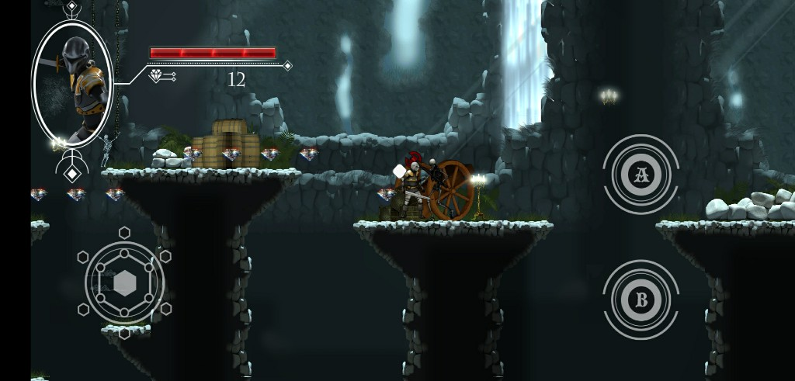

# Dungeon Escape
 Dungeon Escape is a 2d mobile game that is built around collecting diamonds and fighting enemies

## Table of contents
* [General info](#general-info)
* [Screenshots](#screenshots)
* [Technologies](#technologies)
* [Status](#status)
* [Inspiration](#inspiration)
* [Contact](#contact)

## General info
All purpose of the game is to go to the right side where escaping gate exists.

Player can collect diamonds, fight enemies and buy weapons

Player can also gain 100 gem (point) by watching an ad in the shop keeper

## Screenshots
- #### Game Main Menu
  

- #### Game Start
  

- #### Moss Giant Enemy
  

- #### Skeleton Enemy
  

- #### Spider Enemy
  

- #### Shop keeper
  

- #### Shop Panel
  

- #### Game Over Panel
  

## Technologies
* Unity - 2018.3

## Status
Game is not complete yet as there are no:

- Many enemies
- Weapons objects from the shop
- Game completion done yet

 However I will not complete it as I developed it for practicing game development using unity

## Inspiration
Project inspired by [The Ultimate Guide to 2D Mobile Game Development with Unity](https://www.udemy.com/course/the-ultimate-guide-to-mobile-game-development-with-unity/) udemy course

## Contact
Created by [Mohamed Abdelnaby Elattar](https://www.linkedin.com/in/maaelattar) - feel free to contact me!
